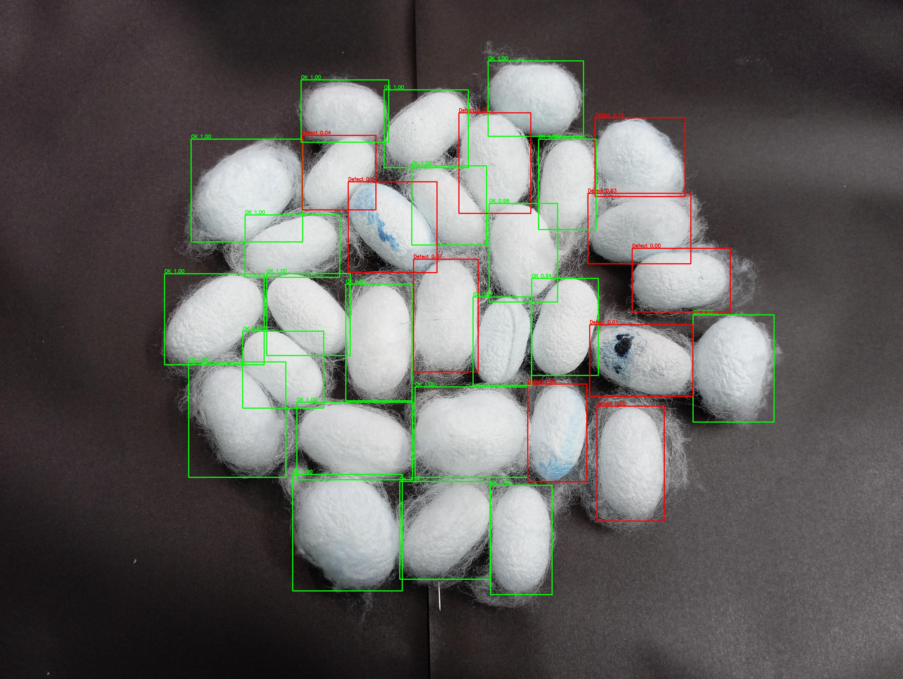
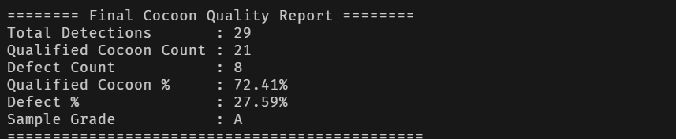
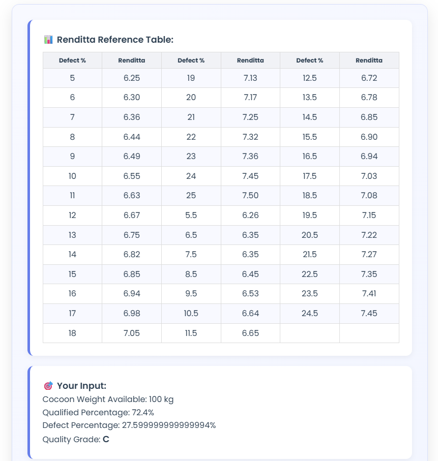
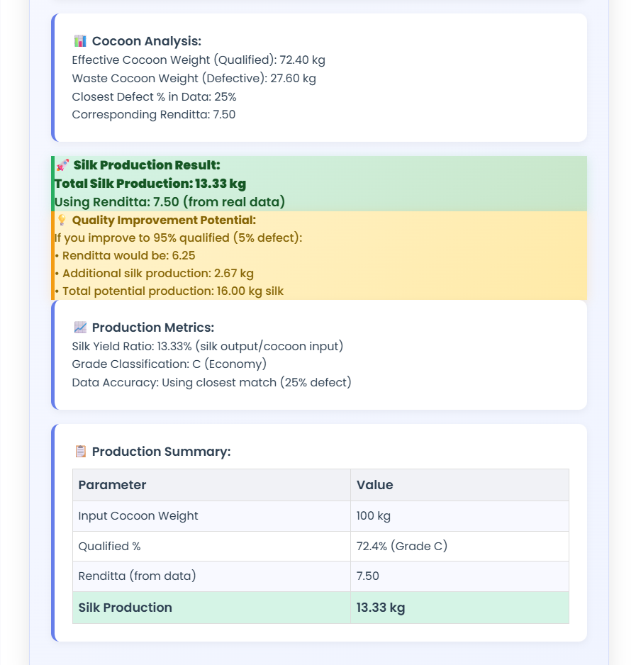

# Silk Cocoon Classification and Market Forecasting

## Overview  
An AI-driven system for automated detection, segmentation, classification, grading, and market price prediction of silk cocoons. Utilizing YOLOv8 for instance segmentation, EfficientNet-B0 for defect classification this end-to-end pipeline empowers stakeholders with consistent quality assessment and data-driven market insights.








## Features  
- **Instance Segmentation**: YOLOv8 identifies and segments individual cocoons in batch images.  
- **Defect Classification**: EfficientNet-B0 classifies each cocoon as Qualified or Defective (Crushed, Decayed, Pierced, Double, Yellow-Spotted).  
- **Automated Grading**: Grades cocoons into A/B/C based on qualified percentage and morphological metrics.  
- **Market Forecasting**: Regression models predict seasonal price trends per grade using historical sales, weather, and disease data.  
- **Real-Time Interface**: Built with HTML, CSS, and JavaScript, featuring interactive image upload, real-time quality metrics, grading, and price estimation.

## Repository Structure  
```
silk_cocoon_classification/
├── data/  
│   ├── images/                 # Raw and annotated cocoon images  
│   ├── market_sales.csv        # Historical market data with weather and disease factors  
│   └── annotations/            # YOLOv8-compatible segmentation labels  
├── models/  
│   ├── best_s_300.pt           # Trained YOLOv8 segmentation weights  
│   └── best_classifier.pth     # Trained EfficientNet-B0 classification weights  
├── notebooks/                  # EDA and model training notebooks  
├── src/  
│   ├── segmentation.py         # YOLOv8 training and inference pipeline  
│   ├── classification.py       # EfficientNet-B0 training and inference pipeline  
│   ├── grading.py              # Grading logic based on classification outputs  
│   ├── forecasting.py          # Market price forecasting models  
│   └── app.py                  # Gradio interface integration  
├── requirements.txt            # Python dependencies  
└── README.md                   # Project documentation  
```

## Installation  
1. Clone the repository:  
   ```bash
   git clone https://github.com/Krrish-agrawal/silk_cocoon_classification.git
   cd silk_cocoon_classification
   ```
2. Create and activate a virtual environment:  
   ```bash
   python3 -m venv venv
   source venv/bin/activate
   ```
3. Install dependencies:  
   ```bash
   pip install -r requirements.txt
   ```

## Usage

### 1. Segmentation  
```bash
python src/segmentation.py \
  --data data/images/ \
  --labels data/annotations/ \
  --weights models/best_s_300.pt \
  --output outputs/segmented/
```

### 2. Classification  
```bash
python src/classification.py \
  --input outputs/segmented/ \
  --weights models/best_classifier.pth \
  --output outputs/classified/
```

### 3. Grading  
```bash
python src/grading.py \
  --input outputs/classified/ \
  --grade-config config/grade_scheme.json \
  --output outputs/graded/
```


### 5. Web Interface  
```bash
python src/app.py
# Open http://localhost:7860 in your browser
```

## Data

- **Cocoon Image Dataset**: 1,588 manually captured images (Bivoltine) annotated into one “cocoon” class and five defect subcategories.  
- **Market Sales Dataset**: Monthly and daily records (2015–2023) including variety, rates, quantity, weather, and disease indicators.

## Model Details

| Component      | Architecture       | Training Data | Performance                          |
|----------------|--------------------|---------------|--------------------------------------|
| Segmentation   | YOLOv8n            | 1,588 images  | mAP@0.5: 96.1%, Precision: 98.3%     |
| Classification | EfficientNet-B0    | Cropped cocoons | Accuracy: 97.0%, F1-Score: 97.0%     |

## Results  
- **Yield estimation**: 96% accuracy vs. actual production  


Contributions are welcome. Please follow these steps:  
1. Fork the repository  
2. Create a feature branch (`git checkout -b feature/YourFeature`)  
3. Commit your changes (`git commit -m "Add feature"`)  
4. Push to the branch (`git push origin feature/YourFeature`)  
5. Open a Pull Request

